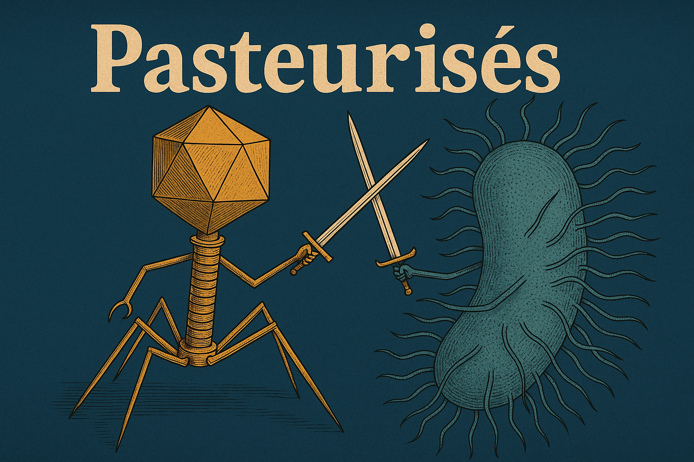

# Phage Genomic Classification using DNA Foundation Models – Phagos x Hackdays 2025

## 🧬 Scientific Context

Bacteriophages (phages), viruses that infect bacteria, play a central role in microbial ecology and phage therapy. Yet, understanding their diversity and behavior in metagenomic samples remains a significant challenge.

**Our goal**: harness the representational power of DNA-specific foundation models to address two key questions:
1. **Can we isolate phage contigs from complex metagenomic mixtures?**
2. **Can we infer a phage’s life cycle—virulent or temperate—directly from its genomic sequence?**

---

## 🚀 Hackathon Context

This project was developed during the **[Phagos x AWS — Hackdays 2025](https://phagos-rd-hackathon25-datasets.s3.eu-west-1.amazonaws.com/phagos_aws_hackathon_kick_off.pdf)**, held in Paris. In 48 hours, we built an end-to-end, biology-informed ML pipeline that combines metagenomic insights with cutting-edge genomic representation models.

---

## 🧬 Method Overview

### 1. Dataset Integration & Fragmentation

We combined two public datasets:
- **Dataset 1** – Metagenomic fragments (bacteria, plasmids, phages)
- **Dataset 2** – DeePhage phages with life cycle annotations

We ensured high-confidence labeling by retaining only overlapping phage entries between datasets and fragmenting sequences with the script from the *Gauge your phage* benchmark study.

> ➡️ Final classes: `Viru` (virulent phage), `Temp` (temperate phage), `Bact` (bacterial contigs)

### 2. Embedding via DNA Foundation Model

We employed [Evo](https://github.com/evo-design/evo), a transformer-based foundation model trained for molecular sequences. The Evo encoder transforms genomic fragments into dense vector representations capturing sequence-level semantics beyond motifs or k-mers.

### 3. Model Architecture

- Jupyter-based PyTorch pipeline
- Evo embeddings fed to a shallow classifier
- 3-way prediction task (Viru / Temp / Bact)
- Mixed precision training with AMP (`autocast`, `GradScaler`)
- Performance monitored using `accuracy_score` and confusion matrices

---

## 📂 Datasets

### Dataset 1: Simulated Metagenome
From Ho et al. (*Microbiome*, 2023) – contains labeled bacterial and phage fragments:
- [Download link](https://phagos-rd-hackathon25-datasets.s3.eu-west-1.amazonaws.com/refseq_simulated_metagenome/refseq_simulated_metagenome.tar.gz)

### Dataset 2: DeePhage
Includes phage genomes with lifestyle annotations (automated + expert-curated):
- [Download link](https://s3.eu-west-1.amazonaws.com/phagos-rd-hackathon25-datasets/deephage/deephage_lifestyle.tar.gz)

---

## 💻 Run Locally

### Requirements

- Python 3.9+
- pip
- Jupyter Notebook

### Setup

```bash
git clone https://github.com/phagos-hackathon25/project-gamma.git
cd phage-llm-classification
pip install -r requirements.txt
```

### ▶️ Run the notebook

Open `prediction.ipynb` using Jupyter and execute the cells sequentially.

---

## 📚 References

- Ho, S.F.S. et al. *Gauge your phage*, Microbiome (2023): [DOI](https://doi.org/10.1186/s40168-023-01533-x)
- Evo Foundation Model: [https://github.com/evo-design/evo](https://github.com/evo-design/evo)

---

## Authors

- [@ktzkvin](https://www.github.com/ktzkvin)
- [@skrinox](https://www.github.com/skrinox)
- [@MarionFresquet](https://www.github.com/marionFresquet)
- [@yellowsmob](https://www.github.com/yellowsmob)


---

**This work demonstrates how biological insight and modern ML tooling can meet in a hackathon setting to generate meaningful scientific workflows.**
